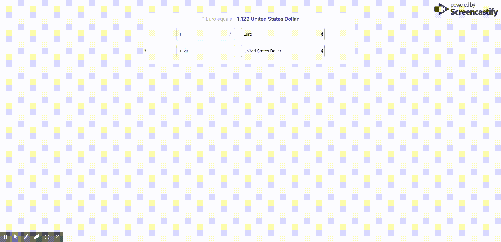

<h1 align="center">
  	   Currnecy Converter
</h1>

  <b>Get Updated currency rate</b> 
  ✨ React and redux app using <a href="https://www.currencyconverterapi.com/">Currency converter API</a> ✨
   
  
   

   <b>Currency Converter</b> is a react application using latest web techonlogeis 
 
   💥Using redux and react creat app 💥

## Installation

* Clone  `git@github.com:HashemKhalifa/currency-converter.git`
* run `npm install` 
* Create a API key from <a href="https://www.currencyconverterapi.com/"> Currency converter API </a>
* Add your key to the `.env` file using `REACT_APP_API_SECERET` variable
* `npm start`
* For testing `npm run test`

## Contributions

* Spread the word
* Open pull requests

## License
MIT © [Hashem Khalifa](https://github.com/hashemkhalifa)
